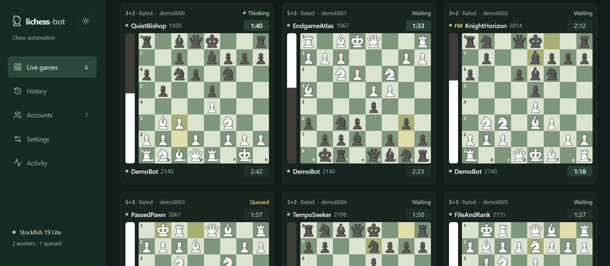

<p align="center">
  
</p>

<h1 align="center">lichess-bot</h1>

<p align="center">
  Automate Lichess matches across multiple accounts with extensible chess engines.
</p>

<p align="center">
  <a href="https://github.com/bariskisir/lichess-bot/tags"></a>
  <a href="LICENSE"></a>
</p>

<p align="center">
  
</p>

> **Educational use:** This project is intended for educational purposes. Use it ethically, respect Lichess rules and other players, and run automation only where permitted.

---

## Development

Requires **Node.js 24 or newer** and npm.

```bash
npm install
npm run dev
```

Open **http://localhost:4173**. The dashboard opens without a password; set one in **Settings → Dashboard access** if needed.

1. Sign in to **lichess.org**, press **F12**, and open **Application → Cookies → https://lichess.org**.
2. Copy the **Value** of the `lila2` cookie. If copied as `lila2=...`, keep only the text after `=`.
3. In the dashboard, open **Accounts → Add account**, enter a name and paste the cookie value. Select **Connect account**, then **Start session** in the sidebar.

## Production

```bash
npm run build
npm start
```

## Documentation

- [Setup and configuration](docs/configuration.md)
- [Dashboard and session controls](docs/usage.md)
- [Architecture and adding engines](docs/architecture.md)
- [Development and testing](docs/development.md)
- [Interface design](DESIGN.md)
